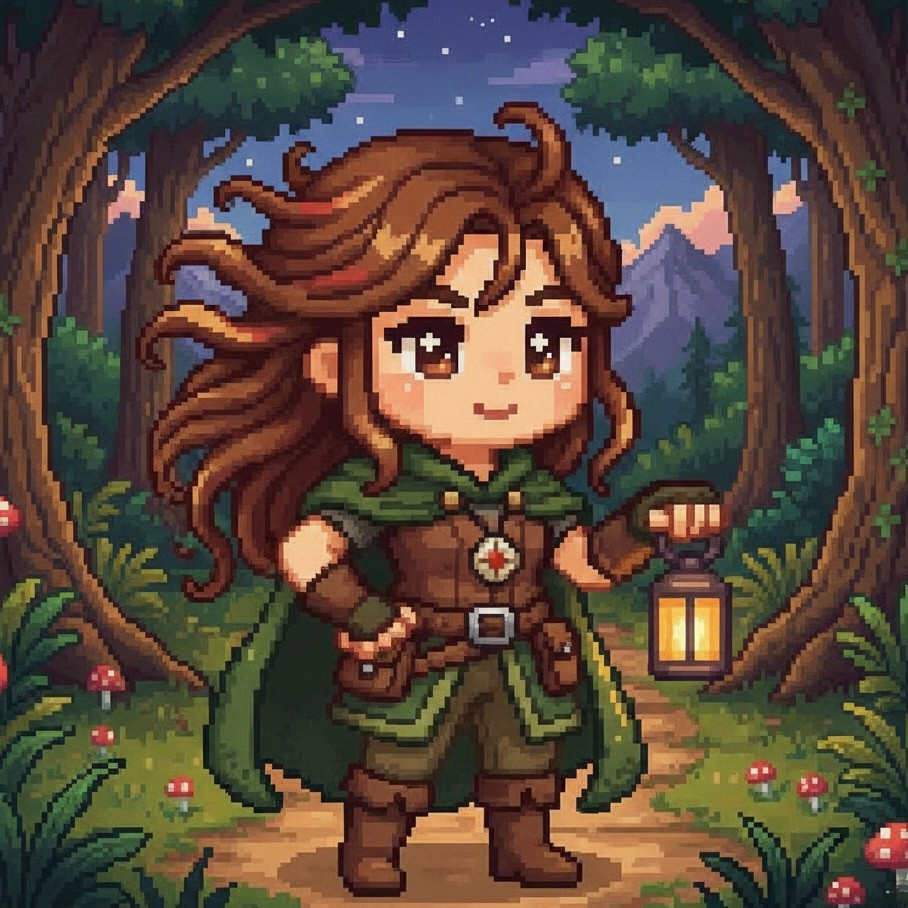

<p align="center">
  
</p>


<p align="center">

  <!-- Game Title -->
  

  <!-- Project Category -->
  

  <!-- Language -->
  

  <!-- Status -->
  

</p>

---


**Sᴏᴜʟ Qᴜᴇsᴛ** ɪs ᴀɴ ɪɴᴛᴇʀᴀᴄᴛɪᴠᴇ sʏsᴛᴇᴍ ᴡʜᴏsᴇ ᴍᴀɪɴ ᴘᴜʀᴘᴏsᴇ ɪs ᴛᴏ ɢᴜɪᴅᴇ ᴜsᴇʀs ɪɴ ᴀ ғᴜɴ ᴀɴᴅ ᴘᴇʀsᴏɴᴀʟɪᴢᴇᴅ ᴊᴏᴜʀɴᴇʏ ᴏғ ᴅɪsᴄᴏᴠᴇʀɪɴɢ ᴛʜᴇɪʀ ᴛʀᴜᴇ ᴘᴇʀsᴏɴᴀʟɪᴛʏ ᴛʏᴘᴇ. ʙʏ ᴀʟʟᴏᴡɪɴɢ ᴇᴠᴇʀʏᴏɴᴇ ᴛᴏ ᴀɴsᴡᴇʀ ᴄᴜʀᴀᴛᴇᴅ Qᴜᴇsᴛɪᴏɴs, ɪᴛ ᴀɪᴍs ᴛᴏ ᴜɴʟᴏᴄᴋ ᴀɴᴅ ʀᴇᴠᴇᴀʟ ᴛʜᴇ ᴍᴀɴʏ ᴠᴇʀsɪᴏɴs ᴏғ ᴛʜᴇᴍsᴇʟᴠᴇs, ᴇɴᴄᴏᴜɴᴛᴇʀ ᴛʜᴇɪʀ ɪɴʜᴇʀᴇɴᴛ ᴀʀᴄʜᴇᴛʏᴘᴇs, ᴀɴᴅ ᴜɴᴄᴏᴠᴇʀ ᴛʜᴇ ʜɪᴅᴅᴇɴ sᴛʀᴇɴɢᴛʜs ᴛʜᴀᴛ ʟɪᴇ ᴡɪᴛʜɪɴ.

<br>

<div align="center">


✮˚.⋆. ݁₊ ⊹ *ᴀʀᴇ ʏᴏᴜ ʀᴇᴀᴅʏ ᴛᴏ ꜰɪɴᴅ ɪᴛ?* ⊹ .⋆. ݁₊˚✮

</div>


<p align="center">
<kbd>✨ Self-Awareness</kbd>
<kbd>🧘 Existential Peace</kbd>
<kbd>🏆 Bragging Rights</kbd>
<kbd>📸 Terminal Screenshots</kbd>
</p>


<div align="center">

## 𝐎𝐕𝐄𝐑𝐕𝐈𝐄𝐖

</div>

<table>
<tr>
<td width="65%">


<div align="center">
  
### ˗ˏˋ🕹️ Main Features ˎˊ˗   

</div>

<br>

Welcome to **Soul Quest** — an interactive, object-oriented personality discovery game coded in Java! This system brings self-discovery to life with a mystical twist.

At its core lies the `Question` abstract class — the universal blueprint for interactive elements. From it, two powerful subclasses emerge:

* 🔮 **`PersonalityQuestion`** – 10 thought-provoking multiple-choice questions that analyze your traits and calculate your dominant personality archetype.

* ✨ **`IceBreaker`** – Four randomized types (Fun Facts, Quotes, Word Scrambles, Riddles) strategically placed to give mental breaks between questions.

Beyond these, **Soul Quest** features complementary systems:

* 🌟 **`Personality Type`** – 10 mystical archetypes (*The Cosmic Dreamer*, *The Phoenix Spirit*, etc.) with unique poetic descriptions.

* 📚 **`Player History`** – Persistent file storage tracking unlocked personalities, completion stats, and timestamps across sessions.

* 🎨 **`Mystical Interface`** – ASCII art, box-drawing borders, Unicode symbols, and dramatic animations creating an immersive terminal experience.

All orchestrated by the `GameEngine` for a seamless self-discovery journey ⚡✨🔮

</td>
<td width="50%">


### 🚧 **The Problem** 


### 🛠️ **Our Solution**


</td>
</tr>
</table>

<br>


<div align="center">

###  ✮ ⋆ ˚｡𖦹 ⋆｡°✩ **The Magic Behind It** ✮ ⋆ ˚｡𖦹 ⋆｡°✩

</div>


<table align="center">
<tr>
<td align="center" width="25%">

<br><b>Object-Oriented</b>
<br><sub>Encapsulation, Inheritance,<br>Polymorphism & Abstraction</sub>
</td>
<td align="center" width="25%">

<br><b>Data Persistence</b>
<br><sub>File I/O with UTF-8<br>formatted storage</sub>
</td>
<td align="center" width="25%">

<br><b>Interactive Quiz</b>
<br><sub>10 questions + dynamic<br>ice breakers</sub>
</td>
<td align="center" width="25%">

<br><b>10 Personalities</b>
<br><sub>Unique archetypes to<br>collect and unlock</sub>
</td>
</tr>
</table>

<div align="center">
  
</div>


<div align="center">
  
## 𝐎𝐁𝐉𝐄𝐂𝐓-𝐎𝐑𝐈𝐄𝐍𝐓𝐄𝐃 𝐏𝐑𝐈𝐍𝐂𝐈𝐏𝐋𝐄𝐒
</div>

<br>

<table>
<tr>
<td width="100%" align="center">

</td>
</tr>
<tr>
<td>

### 🔒 

Encapsulation was applied throughout all classes using **private fields with public methods**. In **`PlayerHistory`**, fields like `playerName`, `unlockedPersonalities`, and `completedGames` are private and can only be modified through methods like `addPersonality()`, `displayHistory()`, and `deleteHistory()`. Similarly, in **`Personality`**, fields like `type`, `description`, and `dateUnlocked` are private with public getter methods.

This bundles data and operations together while protecting internal state from unauthorized external access, ensuring data integrity throughout the game.

</td>
</tr>
</table>

---

<table>
<tr>
<td width="100%" align="center">

</td>
</tr>
<tr>
<td>

### 🌳 

Inheritance was applied when **`PersonalityQuestion`** and **`IceBreaker`** extend the abstract class **`Question`**. Both child classes inherit the `questionText` and `questionNumber` fields from their parent, as well as getter methods like `getQuestionText()` and `getQuestionNumber()`. They use `super()` to call the parent constructor and then add their own specific fields like `options[]` in `PersonalityQuestion` and `type` in `IceBreaker`.

This promotes code reuse and establishes a logical "IS-A" relationship where both types ARE questions but with specialized behaviors.

</td>
</tr>
</table>

---

<table>
<tr>
<td width="100%" align="center">

</td>
</tr>
<tr>
<td>

### 🎭 

Polymorphism was demonstrated in **`GameEngine.startGame()`** where the game loop iterates through a list of `Question` objects. The same method call `q.displayQuestion()` produces different outputs depending on whether the object is a `PersonalityQuestion` (shows multiple choice quiz) or an `IceBreaker` (shows riddles, fun facts, or word scrambles). Similarly, `q.processAnswer()` behaves differently for each question type.

This enables the program to dynamically call the correct version of the method at runtime based on the actual object type.

</td>
</tr>
</table>

---

<table>
<tr>
<td width="100%" align="center">

</td>
</tr>
<tr>
<td>

### 🎨 

Abstraction was implemented in the **`Question` abstract class** where methods like `displayQuestion()` and `processAnswer()` are declared as abstract. Child classes `PersonalityQuestion` and `IceBreaker` must provide their own implementations. Additionally, the **`GameComponent` interface** defines a contract with methods `initialize()`, `execute()`, `cleanup()`, and `isComplete()` that `GameEngine` must implement.

This hides implementation details—the main game loop doesn't need to know HOW each question displays itself, it just calls the method and lets polymorphism handle the rest.

</td>
</tr>
</table>


<br>

<p align="center">
  
## 📋 𝐐𝐔𝐈𝐂𝐊 𝐑𝐄𝐅𝐄𝐑𝐄𝐍𝐂𝐄 𝐓𝐀𝐁𝐋𝐄

| **OOP Concept** | **Where Applied** | **Purpose** |
|-----------------|-------------------|-------------|
| 🔒 Encapsulation | All classes with private fields + getters/setters | Data hiding and controlled access |
| 🌳 Inheritance | `PersonalityQuestion` and `IceBreaker` extend `Question` | Code reuse and hierarchical structure |
| 🎭 Polymorphism | `displayQuestion()` and `processAnswer()` overriding | Different behavior from same method call |
| 🎨 Abstraction | `Question` abstract class & `GameComponent` interface | Hide complexity, define contracts |

</p>

<br>

## 🗃️ 𝐏𝐑𝐎𝐉𝐄𝐂𝐓 𝐒𝐓𝐑𝐔𝐂𝐓𝐔𝐑𝐄
```bash
📂 SoulQuest/
│
├── 📂 src/
│   │
│   ├── 📂 core/
│   │   ├── ☕ GameEngine.java              
│   │   ├── ☕ SoulQuest.java               
│   │   ├── ☕ FileHandler.java             
│   │   ├── ☕ InvalidInputException.java   
│   │   └── 📋 GameComponent.java           
│   │
│   ├── 📂 model/
│   │   ├── ☕ PlayerHistory.java           
│   │   ├── ☕ Personality.java             
│   │   ├── ☕ Question.java               
│   │   ├── ☕ PersonalityQuestion.java     
│   │   └── ☕ IceBreaker.java              
│   │
│   └── 📂 enums/
│       ├── ☕ PersonalityType.java         
│       └── ☕ IceBreakerType.java          
│
└── 📄 soul_quest_data.txt                  
```

<br>


## 🚀 𝐆𝐄𝐓𝐓𝐈𝐍𝐆 𝐒𝐓𝐀𝐑𝐓𝐄𝐃

### Prerequisites
- Java Development Kit (JDK) 8 or higher

### Installation & Running

1. **Clone the repository:**
```bash
git clone https://github.com/Kirstnnlx/soul-quest.git
cd soul-quest
```

2. **Navigate to the src folder:**
```bash
cd src
```

3. **Compile the program:**
```bash
javac core/*.java
```

4. **Run the game:**
```bash
java core.SoulQuest
```

<br>

### ⊹₊⟡⋆ ┊ Welcome Display Snippet
```

███████╗ ██████╗ ██╗   ██╗██╗         ██████╗ ██╗   ██╗███████╗███████╗████████╗
██╔════╝██╔═══██╗██║   ██║██║        ██╔═══██╗██║   ██║██╔════╝██╔════╝╚══██╔══╝
███████╗██║   ██║██║   ██║██║        ██║   ██║██║   ██║█████╗  ███████╗   ██║   
╚════██║██║   ██║██║   ██║██║        ██║▄▄ ██║██║   ██║██╔══╝  ╚════██║   ██║   
███████║╚██████╔╝╚██████╔╝███████╗   ╚██████╔╝╚██████╔╝███████╗███████║   ██║   
╚══════╝ ╚═════╝  ╚═════╝ ╚══════╝    ╚══▀▀═╝  ╚═════╝ ╚══════╝╚══════╝   ╚═╝   

              *.*.* Discover Your True Personality Type *.*.*
                              Version 1.0.0

Enter your name: Celestia
Enter your birthdate (MM/DD/YYYY): 01/01/2001

New soul detected! Creating your cosmic profile...

✦•···························•✦•···························•✦

╔════════════════════════════════════════════════════════════╗
║                         MAIN MENU                          ║
╚════════════════════════════════════════════════════════════╝
          Choose your path, wanderer of the soul...
  
  [1] Start New Game
  [2] View Personality Collection
  [3] Delete History
  [4] Exit

Choose an option: 

```

### ⊹₊⟡⋆ ┊ Question and IceBreaker Preview
```

╔════════════════════════════════════════════════════════════╗
║ Question 6/10                                              ║
╚════════════════════════════════════════════════════════════╝
Your dream superpower would be:

  [1] Mind reading
  [2] Time travel
  [3] Invisibility
  [4] Super strength

Your answer: 1

╔════════════════════════════════════════════════════════════╗
║ ICE BREAKER TIME!                                          ║
╚════════════════════════════════════════════════════════════╝
꩜ Unscramble this word: LUOS

Type your answer or 'give up' to skip: 
SOUL

ᯓ★ Correct! You unscrambled it!

```

### ⊹₊⟡⋆ ┊ Personality Result Preview
```
✦•···························•✦•···························•✦

╔════════════════════════════════════════════════════════════╗
║                  YOUR PERSONALITY REVEALED                 ║
╚════════════════════════════════════════════════════════════╝

>> Congratulations! You've unlocked a piece of your cosmic puzzle.

You are: The Cosmic Dreamer
Your mind dances among stars, painting reality with imagination.

Unlocked on: 2025-11-29
════════════════════════════════════════════════════════════

⋆⭒˚.⋆ Personality added to your collection! ⋆⭒˚.⋆
🗁🗐 Progress saved successfully!

Press ENTER to return to main menu...


✦•···························•✦•···························•✦
```

### ⊹₊⟡⋆ ┊ soul_quest_data.txt Snippet
```

╔═══════════════════════════════════════════════════════════════════════╗
║                      SOUL QUEST - PLAYER DATA                         ║
║                        Personality Archive                            ║
╠═══════════════════════════════════════════════════════════════════════╣
║  Total Players: 1                                                     ║
╚═══════════════════════════════════════════════════════════════════════╝

╔═══════════════════════════════════════════════════════════════════════╗
║ USER:              Celestia (ID: celestia_01012001)                   ║
╠═══════════════════════════════════════════════════════════════════════╣
║  Cosmic Alignment: 01/01/2001                                         ║
║  User ID: celestia_01012001                                           ║
║  Games Completed: 1                                                   ║
║  Last Played: 2025-11-28                                              ║
╠═══════════════════════════════════════════════════════════════════════╣
║                        PERSONALITY COLLECTION                         ║
╠═══════════════════════════════════════════════════════════════════════╣
║  [1] The Cosmic Dreamer                                               ║
╚═══════════════════════════════════════════════════════════════════════╝

```

<br>

### 𝐀𝐂𝐊𝐍𝐎𝐖𝐋𝐄𝐃𝐆𝐄𝐌𝐄𝐍𝐓

We, the Ctrl+Alt+Divas, extend our deepest appreciation to **Sir Emmanuel Charlie Enriquez**, whose expertise, constructive feedback, and encouragement greatly contributed to the completion of this study. His dedication and mentorship have been instrumental in shaping the direction and quality of this project. We also sincerely thank **Ma'am Fatima Marie Agdon** for her valuable guidance, as we were able to successfully apply the principles she taught us when she was our previous professor.

<br>

Lastly, we extend our heartfelt thanks to each member of **Ctrl+Alt+Divas** for the excellent teamwork, patience, and humor shared, which were key to the successful and efficient completion of this project.

<br>


<div align="center">

### 𝐌𝐄𝐄𝐓 𝐓𝐇𝐄 𝐃𝐄𝐕𝐄𝐋𝐎𝐏𝐄𝐑𝐒
<table>
<tr>
<td align="center">
<br>━━━━━━━━━━━<br>
<br>
<b>KIRSTEN ROAN DUMLAO</b><br>
<i>⋅˚₊‧ ‧₊˚ ⋅ CS 2104 ⋅˚₊‧ ‧₊˚ ⋅</i><br>
<i>Grace • Hope • Understanding</i>
</td>
<td align="center">
<br>━━━━━━━━━━━<br>
<br>
<b>AZELLE ANN AGUILAR</b><br>
<i>⋅˚₊‧ ‧₊˚ ⋅ CS 2104 ⋅˚₊‧ ‧₊˚ ⋅</i><br>
<i>Freedom • Adventure • Spirit</i>
</td>
<td align="center">
<br>━━━━━━━━━━━<br>
<br>
<b>JADE ANN COBALES</b><br>
<i>⋅˚₊‧ ‧₊˚ ⋅ CS 2104 ⋅˚₊‧ ‧₊˚ ⋅</i><br>
<i>Imagination • Stars • Wonder</i>
</td>
</tr>
</table>

</div>


<br>
<br>

<div align="center">


<p align="center">

  <!-- Game Title -->

<!-- Project Category -->

<!-- Language -->

<!-- Status -->


</p>


<div align="center">

*© 2025 Ctrl+Alt+Divas. All Rights Reserved.* <br>
*Soul Quest is a project created for educational purposes.*


